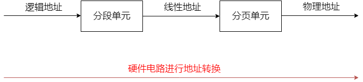

# 主存管理

## 虚拟内存

## 地址映射

## 存储保护

## 存储管理技术

### 分区存储管理

### 页式存储管理

页式存储比较简单，就是将程序的虚地址划分为若干个页，将物理地址也划分为多个块，页和块的大小是相等的，而且是一一对应的关系

先不考虑复杂的情况，假如所有的物理块都映射到了对应的分页上，如上图所示，访问内存的时候，首先需要剥离出页的序号，因为每一个页的大小，通常是1kB或者2KB，4KB，所以32位地址的最后10/11/12位就是对应的偏移地址，而之前的数字就是页号，在进程的页表中查找，将原来的虚地址的页号修改为块号，位移不变，保留下来，就得到了对应的物理地址

### 段式和段页式存储管理

## Linux的存储管理

linux采用了段页式存储管理

80x86微处理器区分三种不同的地址：逻辑地址，线性地址，物理地址

1. 逻辑地址包含在机器指令中，是程序的指令地址或者操作数地址。在段式结构中，一个程序由多个段组成，每一个逻辑地址由段和偏移量组成，偏移量表明了从段开始的地方到实际地址之间的距离
2. 线性地址也成为虚地址，对于32位系统来说，是32位的无符号整数，表达了4GB的虚地址
3. 物理地址就是真正存放信息的实地址

### 从逻辑地址到线性地址的转化

