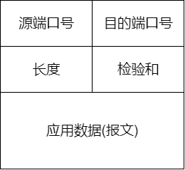
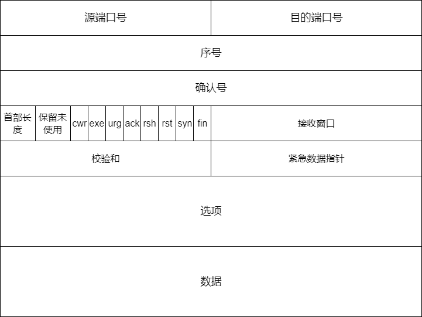

# 运输层

运输层协议为不同主机上面的应用之间，提供了**逻辑通信**

之所以说是逻辑通信，是因为从应用程序的角度看，这些运行不同进程的主机，好像是直接相连一样，实际上，这些主机可能位于地球的两侧

运输层协议是在**端系统**中完成的，而不是在网络核心设备中实现的

## 多路复用和多路分解

### UDP的多路复用：

主机上面的每一个套接字可以分配一个端口号，报文段到达主机的时候，运输层检查报文段中的端口号，将其定向到对应的套接字，书籍由套接字交付给对应的进程

### TCP的多路复用：

## 无连接传输 UDP

udp的头部只有8个byte，分别是源端口号、目的端口号、长度、校验和

使用UDP发送报文段的时候，发送方和接收方的运输层实体之间没有建立连接，没有TCP的那种握手，所以，UDP被称为是无连接的，在下面的应用场景，更适合使用无连接的UDP而不是提供了可靠传输的TCP：

1. 关于发送什么数据以及何时发送的应用层控制更加精细

   TCP有一个拥塞控制机制，当网络链路变得极度拥塞的时候，会遏制TCP的发送方，但是对于实时应用来说，不希望过分延迟报文段的发送，而且，一些少量的丢包对于这些应用也是可以接受的

2. 无需连接建立

   TCP不会引入连接建立的时延，对于文本传输的http协议，可靠的传输是很有必要的，但是，对于流媒体应用和一些网络视频应用，UDP的时延是一个重要的考量

3. 无连接状态

   TCP为了维持连接状态，需要维持一些数据结构，比如，接收和发送缓存，拥塞控制窗口，序号和确认号，UDP既不需要这些参数，也不需要跟踪这些参数

4. 分组首部开销

   对于UDP，首部开销仅仅为8个byte，而TCP有20个byte，其中很多都是为了保证可靠传输

对于UDP传输，可以在应用层的程序自身中建立可靠的传输机制实现和TCP类似的效果

## 可靠数据传输

对于应用层来说，如果其选择了可靠数据传输，那么，下层的网络层的各种实现，对于其都是透明的，只有运输层对其负责

但是，运输层提供了可靠数据传输，其实是建立在网络层的不可靠信道传输的基础之上的，也就是，在网络层中传输，随时可能发生丢包，数据错误等异常情况，需要有一定的协议**保证收发双方都能了解到传输的情况**。

为了让手法双方都知道连接中的收发包的情况，接收方必须要将是否接收包，接收的包是否发生错误，当前已经接收了哪些包等情况反馈回去\(也是以包的形式\)，而发送方也需要在了解到这些反馈的基础上动态调整自己的发送机制。

## 面向连接的运输 TCP

可以将TCP和UDP做一个对比

因为TCP是面向连接的，所以需要有序号和确认号，从而保证收发的双方知道当前连接的传输情况

而为了建立连接，需要有多个标志控制字段，这个需要参照tcp的三次握手和四次挥手

为了进行流量控制，需要有接收窗口字段

### 序号和确认号

最重要的两个字段是序号和确认号字段，是TCP确保可靠传输的关键内容

在了解了GBN和SR协议之后，对于TCP的乱序接收的处理，有两个可以选择的方案：

1. 立即丢弃报文段-------&gt;GBN
2. 保留失序的字节--------&gt;SR

显然，后一种对于网络带宽而言更加有效，所以实际应用中选择的是类似于选择重传协议的实现

## 拥塞控制

TCP的发送方是如何限制向其连接发送流量的？

每一端都是由一个接收缓存，一个发送缓存，几个变量组成的，TCP的拥塞机制还监控着一个变量：**拥塞窗口**\(这其实不是一个窗口，而仅仅是一个变量，表示的是一个大小\)csnd

cwnd对一个TCP发送方能够向网络中发送的流量的速率进行了限制

tcp拥塞控制算法：

