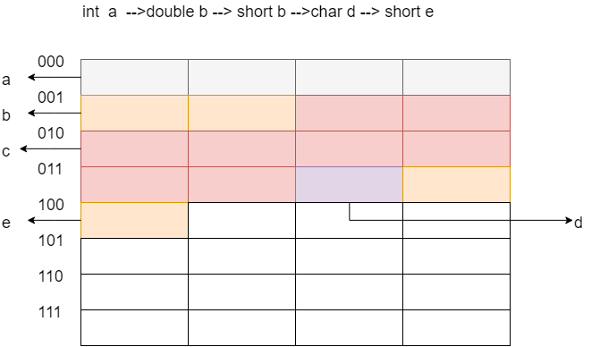

# 存储扩展

存储扩展存在两种方式：

1. 位扩展
2. 字扩展

## 位扩展

单个芯片的字长可能比较短，比如为8位，而CPU对取出的数据的字长的要求是32位，所以需要将多个芯片的结果并联到一起，作为一个结果输出

## 字扩展

单个芯片的容量较小，比如为16kb_8,但是CPU的要求为128kb_8，那么，就需要将多个存储芯片串联在一起，作为一个更大的存储器

## 结构的存储分配——边界对齐

根据CPU的访问规则，每一次是取出连续的4个字节\(对于32位机器\)，如果存储的时候，是按照紧密排列的，虽然节省了空间，但是就会造成对于一个数据的存取，需要访问多次存储空间的问题

所以对于一个地址位数为16位的CPU，如果存储芯片的位数为14位，那么，低2位是不会使用的，也就是说，在存取数据的时候，是根据从2-15位的信号来决定芯片的存取位置

