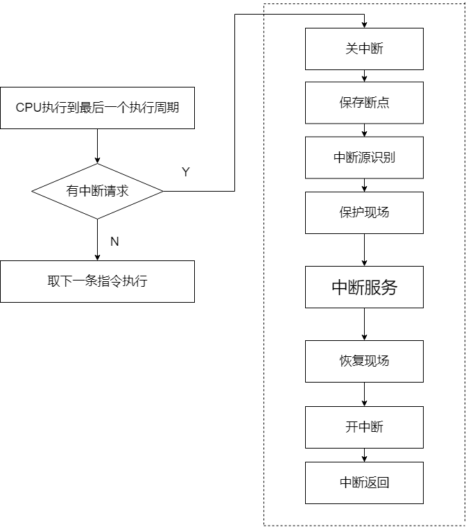
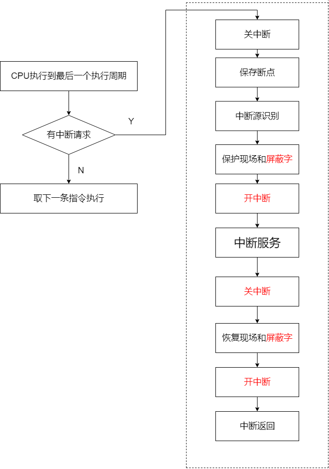

# 中断处理

## 中断的作用

1. 主机和外设同步工作
2. 程序的调试

   在程序的适当的位置设置断点，就利用到了中断指令

3. 故障处理
4. 实时处理
5. 人机交互

中断分类：

1. 软中断（内中断）

   中断原因是当前CPU执行的指令引起的异常，从而中断

   发生异常的原因有：1.fault；2.trap；3.abort

这里的自陷可以好好说明一下，自陷是一种事先被安排的异常，通过某种方式将CPU设置为某种状态，在程序执行的过程中，某条指令之后，使得CPU中设定的状态出现的时候，CPU就会调用对应的中断响应程序，可以有以下几种自陷：1.单步自陷；2.溢出自陷；3.零除自陷；4.自陷指令。其中，单步自陷在单步调试程序的时候就会用到，零除和溢出自陷通常不是刻意安排的，

1. 硬件中断（外中断）

   是外部设备发出的请求，如I/O信息传送请求中断... 往往和执行的程序无关

通常将外部中断称为中断，内部中断称为异常.。

## 中断请求的建立和传送

### 中断源

中断源是发出中断请求的设备或者事件，一台计算机，往往有多个中断源

中断源的中断事件发生的时候，首先将请求信号保存在中断请求触发器中，每一个中断源都有一个中断请求触发器，所有的触发器加在一起，就构成了中断请求寄存器，内容就成为中断字或者中断码

中断请求寄存器的某一位为1，代表对应的设备发出了中断请求，但是，能否传递给CPU，还和这个请求是否被屏蔽有关。每一个中断源都对应一个中断屏蔽寄存器，同样，所有的寄存器加在一起，就构成了中断屏蔽寄存器IMR，内容称为中断屏蔽字，每一位都控制一个中断源的开放和关闭

但是，中断也是分为可以屏蔽和不可屏蔽的，比如断电也是一种中断，显然是无法屏蔽，所以其优先级较高

### 中断响应

#### 响应的条件

1. 执行过开中断指令
2. 对应的中断没有被屏蔽
3. CPU已经执行完一个指令的最后一个状态周期
4. 如果CPU正在执行中断程序，需要新的中断符合嵌套条件
5. 无DMA请求（DMA请求的优先级高于中断）

#### 中断源的识别

1. 程序查询法

   软件实现，依次比较所有的设备的中断请求触发器的值是否为1

2. 硬件查询法

   使用组合逻辑电路，将中断请求寄存器的值转化为中断服务程序的入口地址

#### 获取中断服务程序的入口地址方法

在中断向量表中，通过地址获取对应的中断向量

一个中断向量，由 PC和PSW组成，在80x86机器中，中断向量是CS/IP 两个值

向量中断法处理方式：将各个中断服务程序的中断向量组织为中断向量表，中断响应的时候，识别中断类型编码，计算中断向量的地址，根据向量地址访问中断向量表，读取程序的入口地址PC和PSW\(x86机器上，读取的是IP和段寄存器CS的值\)，CPU就开始执行中断服务程序

## 中断处理流程

单级中断

多级中断

