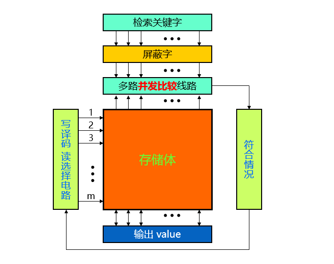

# Cache

## 软件实现的cache

### redis的cache

对于java后端，为了减少数据库的压力，常常需要配备一个cache层，用户对于数据的访问，是直接访问cache，如果找到了，那么直接返回结果，如果没有找到，那么就去数据库中拿到数据，返回给用户，并且将其存在cache中。

redis实现的cache，是以键值对的形式加载在内存中，因为是纯内存操作，Redis的性能非常出色，每秒可以处理超过 10万次读写操作

### redis需要解决的问题

#### 缓存击穿

#### 缓存一致性

#### 缓存雪崩

## 计算机硬件中的cache

### cache发挥的作用

cache距离CPU近，其速度介于CPU和内存之间

由高速缓存Cache来解决主存与CPU的不匹配问题

利用程序访问的局部性原理，将CPU近期用到的程序和数据，提前从主存送到cache

### 设置cache的可行性

为了解决慢速的主存和高速的CPU之间的存储墙，引入了cache来缓存数据，这样，就不需要每一次都到主存去取数据了

从软硬件协同的角度，可以增加cache的容量，也可以加强程序的空间局部性，来提高缓存命中的概率

### 关键技术

1. 数据查找

   如何查询数据是否位于cache中

2. 地址映射

   主存中的数据位置和cache中的位置的对应关系

3. 替换策略

   cache满了之后，要继续写入应该如何取舍

4. 写入策略

   保证cache和memory的一致性

### 相联存储器

作用：判断CPU要访问的内容是否在Cache中

要进行判断，就需要对地址进行查找

查找的方法

1. 代码实现的二分查找等快速查找算法
2. 硬件实现的并发查找

相联存储器就是使用了硬件的并发查找

首先是通过检索的关键字，获取key值，然后根据key值进行硬件的并发比较

硬件的并发比较

### 地址映射规则

将主存划分为多个块，每一个块对应的是4个字节，同时，一个cache行也是4个字节，查找的时候，给出的是块地址+块内偏移地址，通过块地址，和相联存储器中的关键字进行并发的比较，然后最后使用一个多路选择器，一个块的4个字节分别作为其输入，块内偏移地址作为选择输入端，最后就选择了一个字节的数据

#### 全相联

全相联中，主存的块可以放在任意的cache行

#### 直接相联

直接相联的行索引的大小，就是 cache的行数

#### 组相联

组相联的组索引的大小，就是cache中的组数，组数 * 组的大小 = cache的行数

组相联之所以介于两者之间，就是因为当k路组相联的k=1的时候，就相当于没有进行分组，就是直接相联，当k= $2^{s}$ 的时候，就相当于将所有的cache行都划分到一组中了，就是全相联

从形式上理解，显然组相联和直接相联要接近一点，因为这两者都是对于主存的块进行轮流的标记划分，按照 $2^{s}$ 一轮来作为划分，可以将cache的组看成是一个更大的行

注意，这里的组相联有两种实现方式，（待完善）

来看一下组相联的硬件逻辑实现，主存地址划分为了三个部分的内容，分别是  

tag：每一个块地址的标签（可以理解为块地址）

index：需要选择的块位于哪一个组

offset：块内偏移量

对于一个主存的地址，**只会有一个组和其对应**，所以，首先将index送入组索引译码器中，输出的信号送入组的使能端，然后在唯一有效的那个组中，进行**k路并发比较**，就是通过有效位tag来和主存地址中的tag位比较即可，剩下的对于字的选择，和之前的都是类似的操作

#### 不同映射方式的主存地址的划分

**组相联是介于全相联和直接相联之间的一种折中的方式**

#### 容量计算

Cache容量 = 行大小 * 行数    =（标记位+标志位+数据块+置换标记）*  行数

​         

### 替换策略

下面是几种常用的替换策略，不仅仅是在缓存中，在操作系统中也是这样

1. 先进先出法
2. 最近最不经常使用方法---LFU
3. 近期最少使用法--- LRU
4. 随机替换法

#### FIFO算法

这里右上角的角标，记录的是进入的次序，每一次，需要淘汰的是进入的最早的那个

当已经记录满了之后，每一次如果需要更新，则每一个cache块的角标=(角标+1)%4

（这里的4是cache的总行数）

#### LFU算法：最近最不常用

右上角的角标，记录的是该cache行的使用的次数，每一次淘汰的是使用次数最少的，并且序号最小的那个cache行

注意，这里的使用次数，指的是将主存内容调入cache之后，再次访问cache命中的次数

#### LRU算法：最久未使用算法

右上角的角标，记录的是对应的cache行在调入或者上一次使用之后，未被使用的时间，选择的是时间最久的，并且序号尽可能小

### 写入策略

1. 写回法(write back)
2. 写穿法 (write through)
3. 写分配（write-allocate）
4. 写不分配（not-write-allocate）

