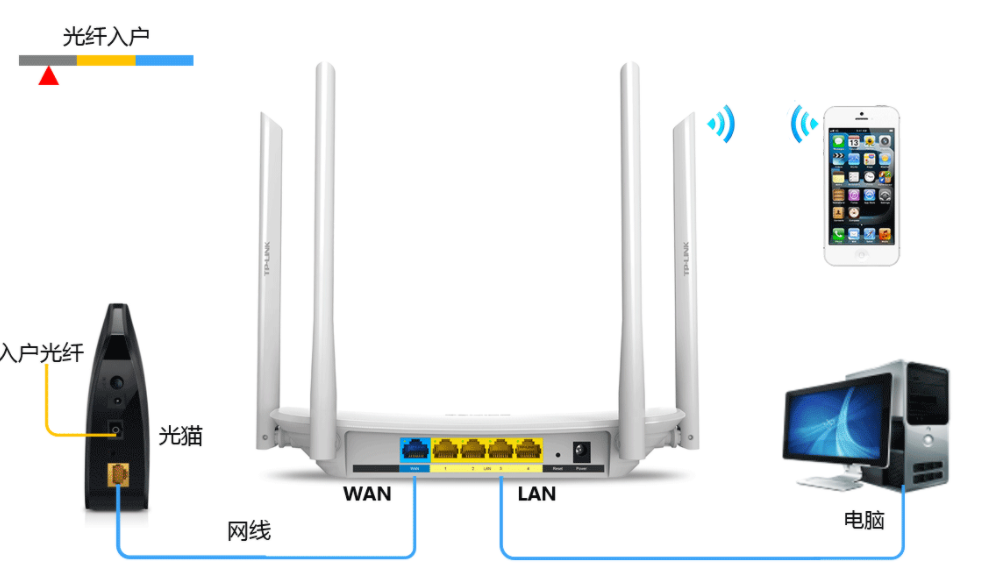
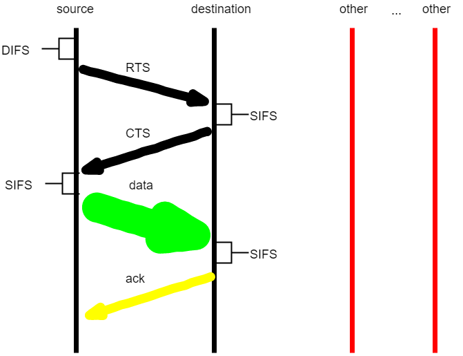
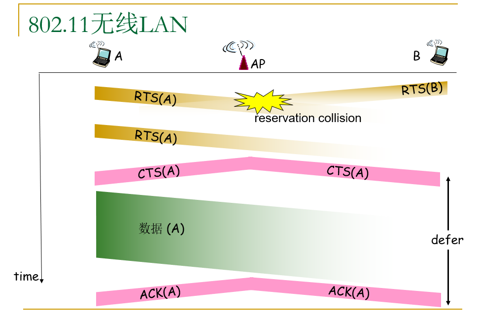
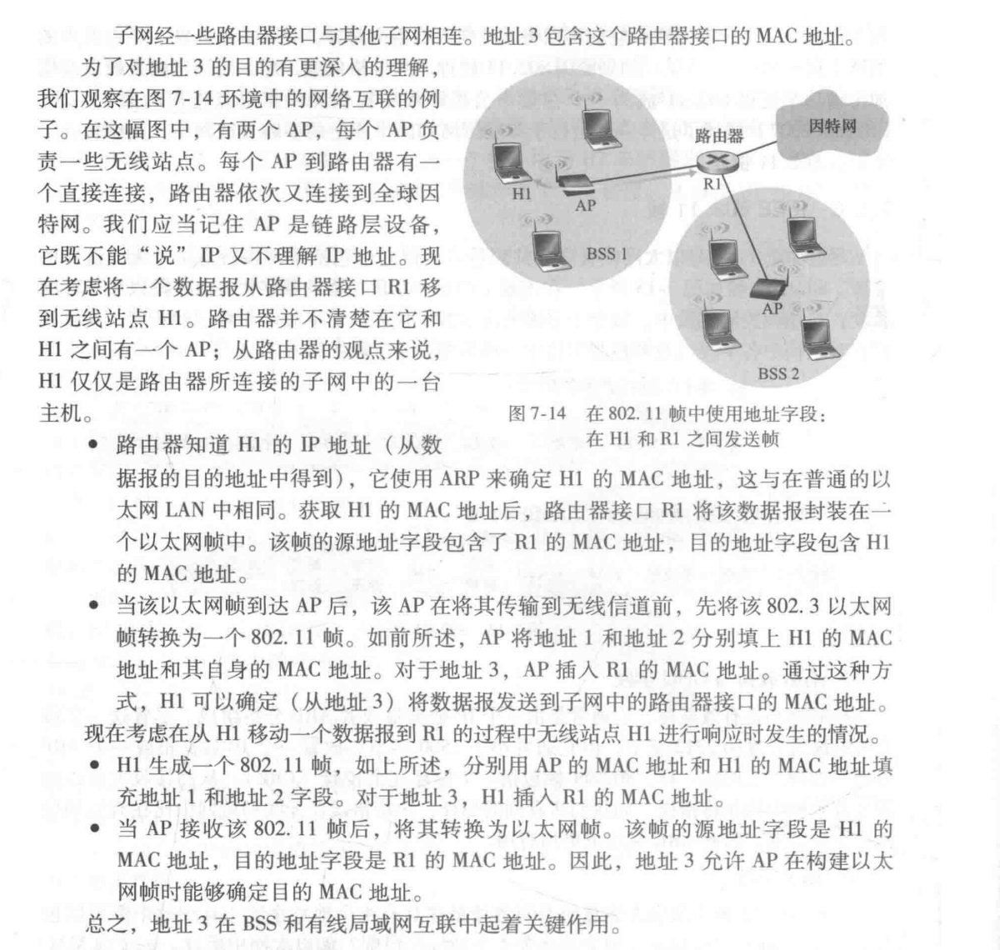

# 无线网

**什么是无线网络？**  基于无线链路的通信

**那么什么是无线链路？** 无线链路指的是大气层，为了将主机和大气层连接，需要使用基站

**什么是基站？** 它负责向关联的无线主机发送数据和从主机那里接收数据。基站通常负责协调相关联的多个无线主机的传输，起到了中继的作用，多个基站联系起来，就构成了网络基础设施

**网络基础设施？**  将多个基站预先建立起来，能够覆盖一定的范围

## 特征

1. 信号强度递减
2. 来自其他源的干扰
3. 多路径传播
4. 比特差错更为常见

因此，需要使用差错处理机制：

1. CRC循环冗余校验
2. ARQ重传

为了描述链路的质量，需要有一定的依据：

1. 信噪比 SNR
2. 比特差错率 BER

信噪比和比特差错率是相反的关系

无线通信存在的问题：

1. 障碍物
2. 信号衰减

## 复用问题

1. 频分复用
2. 时分复用
3. 码分复用

频分复用和时分复用虽然在用户数量很少的情况下，可以解决复用的问题，提高传输的效率，但是，用户数量增大之后，就无法解决这个问题了

码分复用的思想就是，每一个负责发送和接收信息的基站，都通过一个序列来表示1，发送1的时候，需要发送一整个序列，发送0的时候，需要发送整个序列的反码，比如原来要发送101，码片序列为1100，那么，发送的数据就是：

1100 0011 1100 

为了保证数据在大气中叠加之后，不会发生冲突，这里规定，不同的码片序列，需要满足正交性：

1. 任何两个站点，码片序列的向量的点积为0
2. 任何一个码片序列向量和自己的点积为1
3. 任何一个码片序列向量和其反码的点积为-1

这样，即使在大气中发生了叠加，接收方使用特定的码片序列解码之后，仍然能得到正确的结果

比如A基站序列为Ax,B基站序列为Bx，对于一个bit的数据，经过A表示之后，就成为了Ax这样一个序列，经过B表示之后，就成为了Bx这样一个序列，叠加之后就是 (Ax+Bx)

接收方使用Ax进行解码，Ax*(Ax+Bx)=1,这样就得到了A想要发送的一个bit

使用无线网络在大气中传播，而且是容易衰减和出错的无线电波，就需要好好考虑

## 家用路由器，网络层路由器，猫的区别

猫的英文名称为modern，因为谐音被中国人成为猫，全称为调制解调器，由其名字可以看出，其作用就是调制和解调两个。

计算机使用的都是数字信号，但是在实际链路中传输的时候，使用的可以是光信号，也可以是模拟信号，所以需要有一个转换器，modern就是这个作用，调制指的是将传输使用的信号转换为模拟信号，解调则是将传输使用的信号转换为数字信号

如图所示，家用上网，和最外面的线路连接的就是modern，如果是光纤的话，就是光猫，将光信号转换为数字信号，如果是adsl拨号上网，那么就是连接电话线的猫，将模拟信号转换为数字信号，然后连接的是无线路由器

这里的无线路由器，是家用类型，一般是带有一个wan，用于接入网络，而内部有3-4个lan交换模块，当接口不够用的时候，才需要使用交换机来扩展接口

## 两种无线网络

### wifi

#### 什么是wifi

wifi就是执行802.11协议的无线网LAN

802.11协议是一个协议簇，包含了多个协议，如802.11a,802.11b,802.11n,802.11ac，每一个协议都有不同的传输的频率范围和传输速率

### 蜂窝网

## 连接建立过程

### CSMA/CA

802.11采取了CSMA/CA(冲突避免)而不是CSMA/CD(碰撞检测)，其中，CSMA仍然代表的是 **载波监听多路访问**，意味着每一个站点在传输之前，都需要侦听信道，如果侦听到信道忙，就需要等待，之所以采用了冲突避免的方法，是因为，检测碰撞的能力，要求发送方同时具有发送和接收的能力，而在802.11适配器上，接收信号的强度，远远小于发送信号的强度，制造具有检测碰撞能力的硬件的难度大，而且，无线信号的衰减很厉害，适配器可能无法检测到所有的碰撞

思路：允许发送方“预约”信道（通过短的允许发送控制帧）而不是随机访问，从而避免长的数据帧冲突

在发送数据帧之前，先使用CSMA协议，发送一个很短的RTS（request-to-send）帧，这个帧会广播给其余所有的节点，如果节点侦听到了，那么就会推迟发送数据帧，从而避免了冲突的发生，然后目的地的AP收到了请求帧之后，也会发送一个广播CTS（clear-to-send），告诉请求方可以发送数据了，告诉其余的结点，当前信道已经被预约了，不要发送数据

如果在发送RTS报文的时候，发生了冲突，就会随机回退一定的时间，然后重新发送

注意到，这里的RTS(request to send)是一个很短的报文，如果和data一样大，那么就达不到减少冲突的代价的目的，只有当RTS和CTS(clear to send)远小于data和ack的时候，这里的RTS/CTS交换才是高效的

宏观的过程：

每一个AP周期性发送信标帧，包括了AP的SSID和MAC地址   --->信标帧允许附近的⽆线站发现和识别AP  

每一个主机，对于11个信道进行扫描，获取所有可用的AP的信标帧

主机选择一个AP进行关联，假如其所属的子网

主机向关联的AP发送DHCP发现报文，获取IP地址

可能存在身份鉴别

#### 从两个方面提高了性能

1. 一定程度上缓解了隐藏终端问题，因为长的DATA帧只有在预约成功之后才会被发送
2. 因为RTS和CTS帧较短，涉及RTS和CTS的碰撞仅仅会持续很短的时间，一旦被正确传输，那么后续的DATA就可以被无碰撞地传输了

tips：

**AP是什么?**

Access Point，即无线接入点，它用于无线网络的无线交换机，也是无线网络的核心，无线AP是移动计算机进入有线网络的接入点

**AP和无线路由器的区别和联系？**

## 802.11无线网

### 帧格式

无线网的帧具有一定的格式，其中，最重要的字段就是mac地址

一共有四个mac地址字段，分别是：

接收方的mac地址，发送方的mac地址，路由器的mac地址，自组织模式的互相转发的时候使用的mac地址

，具体的含义见下面的分析

### 高级特色

1. 速率自适应

   如果信噪比高的话，就会增加传输速率，信噪比低的话，就会降低传输速率（手机wifi信号的强弱，通常格子数可以表明这个网络的情况）

2. 功率管理

   结点可以在睡眠和唤醒这两个状态之间交替

