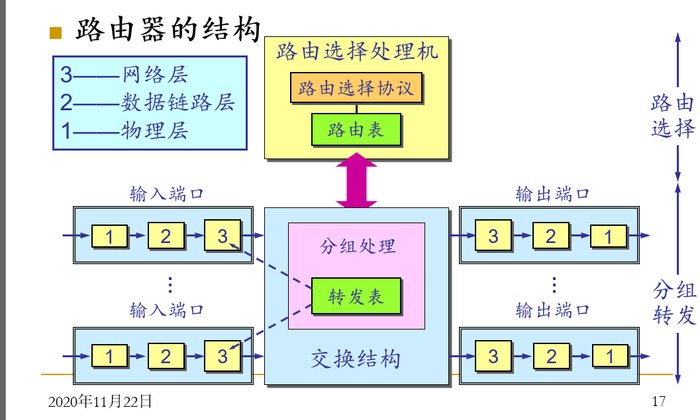
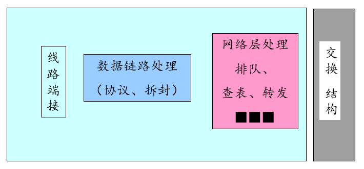
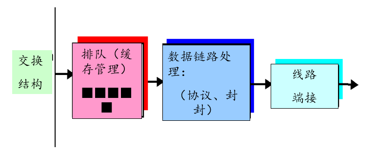
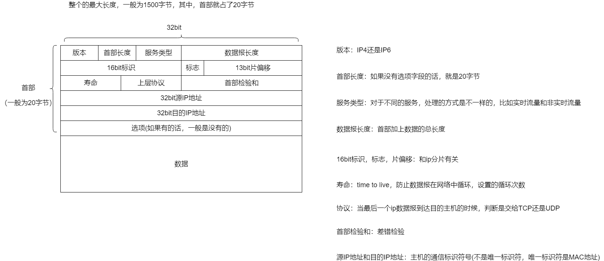
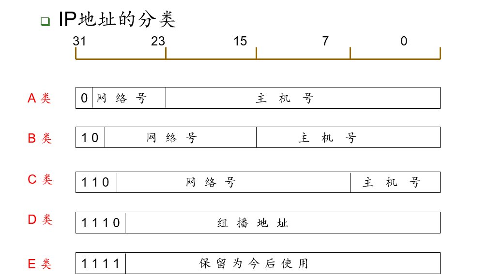

# 网络层

## 网络层功能

1. 选路

   为主机之间的通信选择最合适的路径

2. 转发

   根据转发表和分组的头部信息，将分组向合适的链路转发

3. 连接建立

   对于面向连接的网络层服务，需要承担连接建立的任务

网络层是提供了主机到主机的服务，所以需要IP地址，而运输层是提供了进程到进程的服务，所以需要有端口号

运输层的服务，在网络边缘的端系统中实现，而网络层的服务，在整个网络中实现，包含了路由器，这句话的意思是，运输层的服务，不管是可靠传输还是不可靠传输，都是在发送方和接收方这两个端设备上面实现的，拿TCP来说，即使其需要保证可靠传输，也只需要判断发送的报文超时时间以及接受的相应报文的情况，而中间的实际的传输路径对于其是透明的，但是，网络层负责选路以及转发，所以，数据从源主机发送到目的主机的整个过程，都有网络层的参与。

tips：

分组交换机的分类：

1. 根据链路层首部信息进行转发------链路层交换机
2. 根据网络层首部信息进行转发------路由器

网络层提供的服务

1. 确保交付
2. 具有时延上界的确保交付
3. 有序分组交付
4. 确保最小带宽
5. 确保最大时延抖动

## 虚电路和数据报网络

虚电路：面向连接，需要事先握手

数据报：面向无连接，不需事先握手

### 虚电路

使得收发双方的路径的表现如果**电话线路**一样，所以是面向连接的，而且，数据开始传送之前，需要建立呼叫，数据传输结束时候需要断开，路径上的每一个路由器必须为进行中的连接维持连接状态，并且，每一个分组都携带着虚电路的标识

### 数据报

网络层中，不需要建立连接，也就是在路由器中，不需要维持连接的状态信息

传输的时候，只需要目的主机的地址信息即可，同一对源/目的主机之间的传输路径可能不唯一

## 路由器的工作原理

路由器的工作也是分层次的，因为路由器是位于网络层的设备，所以，还需要处理数据链路层和物理层的操作

流水线的第一步是输入，然后经过查找转发表，发送到输出端口(不是应用层的端口，是具体的网络设备)，而这里的发向哪一个端口，需要通过上层的网络层的路由选择协议来完成

## IP协议

### 结构

ip数据报的结构和其各个字段的功能如下所示：

**tips**

1. 这里的首部长度是以4字节为单位来计算的，因此4个bit最多的范围是60字节
2. 片偏移是以8字节为单位的，比如一个报文的数据是从1480字节开始的，那么片偏移是1480/8=375 
3. IP数据报的最大长度理论上是65535字节，但是，很少有超过1500字节的，因为数据链路层的最大长度的以太网帧的pyload字段为1500字节
4. 首部检验和是必须的，因为虽然TCP协议也实现了检验和，但是那个是对于TCP/UDP的报文段进行的，而TCP/UDP和IP不一定属于一个协议栈，TCP也可以运行在一个不同的协议上，如ATM，IP也可以携带不一定要传递给TCP/UDP的数据（比如ICMP报文）
5. 前面也说了，IP不一定要携带TCP/UDP的数据，也可以携带如ICMP的报文

### 编址

IP 地址只和接口有关, 而与主机,路由器却没有太多关联

我们平时使用的ip格式，是点分十进制，192.168.1.2/x这样的格式，代表着ip地址/网络号的位数

a.b.c.d/x 的最高的x bit的数据

### CIDR（classless interdomain routing）和分类ip地址

我们平时说的分配一个IP地址，还是会分类，到底是 A类，B类还是C类IP地址，然而，当我们获得了某个（些）IP地址之后，就可以进行子网的划分，划分出来的子网才是路由器寻址的最小单位

多个子网可以进行聚合，也就是路由器使用单个前缀来**通告**（也就是说，我，路由器和这些网络都是连接的）多个网络，也称为路由聚合

因此，在使用路由器进行匹配的时候，需要根据**最长匹配原则**，因为同一个CIDR地址可能被多个前缀匹配，匹配的时候，当然是越详细越好

## IPV4和IPV6

从ipv4到ipv6的过渡：

1. 标记日(不太可行)
2. 隧道技术