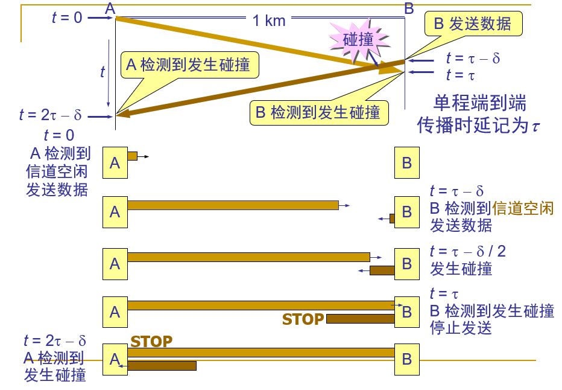

# 链路层

## 链路层提供的服务

## 两种方式

1. 点到点  ppp
2. 广播

## 以太网的类型

1. 总线式

   和CPU一样，所有的主机通过总线连接，这里就需要考虑到碰撞的问题

2. 交换式

   通过集线器或者交换机，在主机之间交换数据

以太网提供的是不可靠的传输

## 多路访问链路和协议

### 多址访问协议

#### 分类

1. 信道划分协议
2. 随机访问协议
3. 轮流协议

#### 信道划分协议

思想：将信道划分成小的“片”（时隙、频率、编码），将“片”分配给节点使用

分类：

1. TDMA(Time Division Multiple Access) 时分复用
2. FDMA(Frequence Division Multiple Access) 频分复用

#### 随机访问协议

当结点有数据发送的时候，会以全速率发送，但是，当有两个或者两个以上的结点发送数据的时候，就可能会出现碰撞

所以，这个协议要解决的问题就是如何检测出碰撞，以及出现碰撞之后如何解决这两大问题

##### ALOHA

##### 时隙ALOHA

##### CSMA

**思想**：传输前监听，如果信道空闲，传送整个帧，如果信道忙，推迟传送

###### 分类

1. 非坚持

   一旦监听到信道忙（即发现有其他站在发送数据），就不再坚持听下去，而是按照算法随机等待一段时间之后，再来监听信道的状态

2. 1坚持（这里的1代表坚持的概率）

   监听到信道忙（即发现有其他站在发送数据）之后，会继续等待下去，直到信道空闲的时候，发送数据，如果发生了碰撞，那么，按照算法随机等待一段时间之后，再重新开始

3. p坚持

   监听到信道忙（即发现有其他站在发送数据）之后，会继续等待下去，直到信道空闲的时候，会以概率p发送数据，以概率（1-p）延迟一段时间$\tau$   （这里的 $\tau$ 是链路中最远的端到端时延 ）发送数据，如果发生了碰撞，那么，按照算法随机等待一段时间之后，再重新开始

实际上，通常使用1坚持策略，因为这样可以充分利用信道刚刚发送完成到下一次发送之间的时隙（相比于非坚持）

##### CSMA/CD  冲突检测

**使用场景：有线局域网**

tips：这里的对于有线和无线的CSMA的方式的选择，是要根据检测碰撞的难度来决定的，有线连接比较容易被检测，只需要测量信号的强度就可以了，但是，无线连接中，传输的时候，发送方的接收器是关闭的，无法检测出信号的强度

要求设备在发送帧的同时要对信道进行侦听，以确定是否会发生信道冲突，若在发送数据过程中检测到冲突，则需要进行冲突处理

处理的过程如下图所示，这里的 $\delta$  是一个随机的时间

如果成功发送，没有发生碰撞，至少2*$\tau$ 时间内不能检测到碰撞，这个时间段就叫作争用期

一旦发生了碰撞，除了立即停止发送数据之外，还需要发送强化碰撞的人为干扰信号（冲突的双方都要发送），来表明当前的链路发生了冲突

**有一个疑惑在这里给大家解开**：

CSMA/CD技术，在早期的共享式以太网中发挥了很大的作用，因为共享式以太网中，数据的传输是在**同一线路**上进行的，以太网使用了基于共享介质的广播技术，同一时间，只能有一面的信号在上面传输，也就是要么从A发向B，要么从B发向A，不能AB同时发送（半双工），如果线路上已经有了信号，信号就会发生碰撞

但是后来随着交换式以太网的发展，这个技术已经逐步淘汰了，主要是因为介质和交换技术的发展带来的改变

介质的改变：使用4对线的UTP,传输和接收各自使用一对,可以全双工方式工作,这样,一边只管发,一边只管收,因此就能够避免碰撞了,光纤方面也可如此

交换技术：当两个工作站需要通信时,交换技术在两个站之间建立了一个点到点的虚链路,也叫做微分段,因此同样也避免了碰撞

但是这并没有和以太网的访问控制机制冲突，在半双工状态下，连接在一个交换机上的设备，其接收和发送是冲突的，同样需要CSMA/CD协议，但是，在全双工工作模式下的以太网，不需要使用CSMA/CD检测机制来避免冲突，因为全双工下，发送和接收是分开的2条链路，不需要实现冲突检测

tips：半双工工作模式的典型接入设备就是集线器

##### CSMA/CA  冲突避免

见无线网章节的分析

**使用场景：无线局域网**

要求设备要主动避免冲突而非被动侦测的方式来解决冲突问题

避免冲突的方法：

## 交换局域网

### mac地址

mac地址是所有的设备的身份证号码，而ip地址相当于一个收件地址，数据链路层的数据传输的时候，是要根据mac地址来确定将帧传递给的**下一个**物理机，而在数据链路层，ip地址的作用就是根据arp协议，找到ip对应的主机的mac地址，这样才能发送

mac地址是平面地址，相当于身份证号，不会改变

ip地址是层次地址，相当于邮件通信地址，主机迁移到不同的地方的时候，ip地址可能需要改变来适应新的环境

### arp协议 （address resolution protocol）

作用：根据目标的ip地址获取其mac地址，然后再本地构建arp高速缓存：有多个 < IP; MAC;TTL> 这样的表项构成，ttl是最大存活时间，超过这个时间，缓存就失效

tips：

1. arp只为在同一子网上的主机和路由器的接口解析ip地址，dns可以为网络中任何地方的主机解析主机名
2. 如果是子网之外的ip，那么，通过arp协议，就得到了路由器的端口的mac地址

### 以太网

分类：

1. 总线式
2. 交换式

提供的服务：

1. 无连接服务

   接收适配器和发送适配器之间，不需要建立连接

2. 不可靠服务

   接收适配器不发送确认帧获取否认帧给发送适配器，具体的可靠服务的实现，要交给上层的TCP来实现

### 集线器和交换机

### 交换机 VS 路由器

交换器和路由器都是存储转发，分组交换设备，路由器使用了ip地址转发，而交换器使用了mac地址转发

#### 交换机的优缺点

##### 优点

1. 交换机是即插即用的
2. 具有较高的分组过滤和转发速率

##### 缺点

1. 为了防止广播帧的循环，交换网络的活跃拓扑必须限制为一个生成树，这样就不具备灵活的拓扑
2. 交换机对于广播风暴没有保护措施

##### 交换机的关键指标

1. 转发技术

2. 背板吞吐量及缓冲区大小

3. 延时

4. 管理功能

5. MAC地址表大小及MAC地址类型

6. **扩展树**

   为了防止拓扑环现象，交换机在检测到拓扑环之后，需要将其从某个位置切开，维持拓扑树的完整性

7. **是否全双工**

   全双工和半双工的效率差别很大，具有全双工功能的交换机可实现高吞吐量(两倍于单工模式端口吞吐量)、避免碰撞、突破CSMA/CD链路长度限制

8. 高速端口集成

9. 最大**VLAN数量**

   需要能够满足企业中的划分vlan的需要，一般来说，1024个vlan足够使用了

10. 扩充性配置

#### 路由器的优缺点

##### 优点

1. 路由器是分层次的，存在冗余路径的时候，分组不会通过路由器循环
2. 路由器没有生成树的限制，可以使用丰富的拓扑结构来构建因特网，并且能够提供负载均衡功能
3. 

##### 缺点

1. 不是即插即用的设备，需要人为配置ip地址（虽然也可以使用DHCP）
2. 处理时间比交换器更长，因为层次比链路层高了一层

### 冲突域和广播域

冲突域是物理层的概念，广播域是数据链路层的概念。

在CSMA/CD协议中，确实会发生冲突，这个是因为采用了分享式的以太网，但是使用交换局域网之后，每一个节点之间的联系被交换机隔开了，所以不会发生冲突，一个冲突域就是连接在同一个导线上的所有的Computer的集合，也可以说是在以太网上争夺同一个带宽的节点的集合

而广播域是信息的传播方式，指的是网络中的某一个设备同时向网络中所有的其它的设备发送数据，这个数据能够到达的范围就是广播域，也就是说，一个广播域的所有的节点，都可以收到其余的节点的广播信息。

一个局域网就是一个广播域，每一个广播域被路由器分隔开了，不同的广播域之间无法收到广播信息，第二层的交换机的所有的端口都工作在一个广播域中，而交换机的一个端口上的一条线路，属于一个冲突域

工作在第一层的HUB（交换机），其所有的端口都在一个广播域，同时也在一个冲突域中，其无法识别MAC和IP地址，仅仅是对接收到的信号进行再生整形放大，以扩大网络的传输距离

## vlan

比较复杂，也比较重要，单独开一个章节来分析

## 问题解答

1. 无线路由器和无线AP

   

2. 光猫是什么东西

